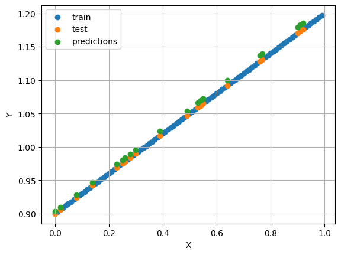
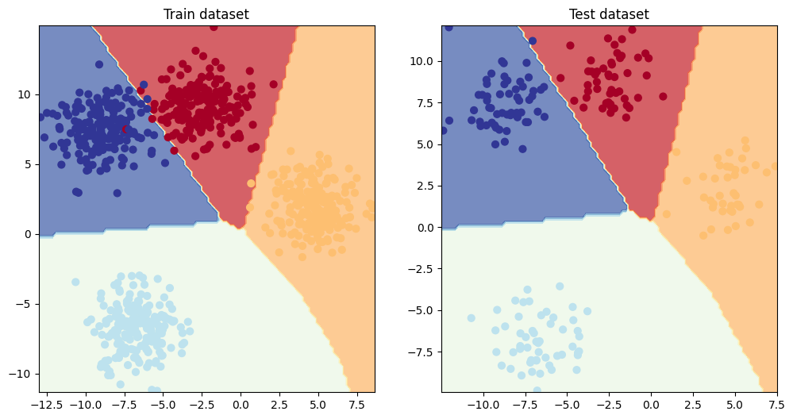
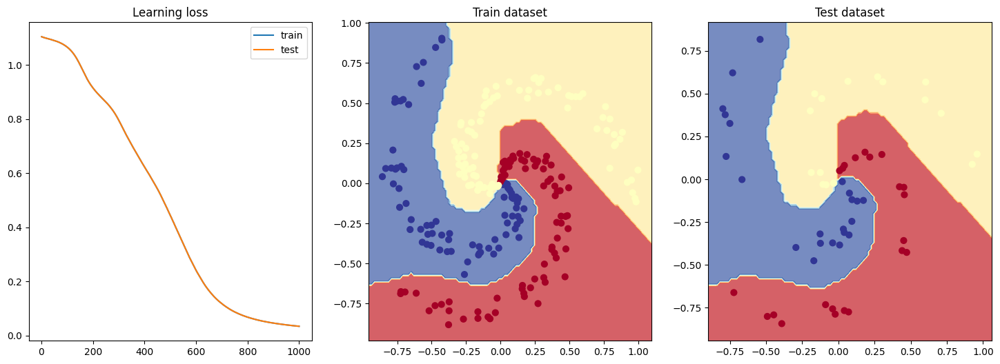

# pytorch-deep-learning-ZTM

This is a simple repository sharing my notes taken during the completion of Zero To Mastery's [52h course on Deep Learning using Pytorch](https://www.udemy.com/course/pytorch-for-deep-learning) on Udemy.

https://github.com/R-MR-Adao/pytorch-deep-learning-ZTM/assets/111191306/5de22d89-c514-43ce-bc54-5886fcc1fc28

[See original video](https://www.youtube.com/watch?v=XOshEyGSdkA)

This repository is based on the materials shared throughout the video lessons, as well as the contents made publicly available on the course's official Github: [https://github.com/mrdbourke/pytorch-deep-learning](https://github.com/mrdbourke/pytorch-deep-learning)

# Table of Contents
- [pytorch-deep-learning-ZTM](#pytorch-deep-learning-ztm)
- [Table of Contents](#table-of-contents)
- [Modules](#modules)
  - [0. PyTorch fundamentals](#0-pytorch-fundamentals)
  - [1. PyTorch workflow](#1-pytorch-workflow)
  - [2. PyTorch Classification](#2-pytorch-classification)
  - [3. To be continued...](#3-to-be-continued)

# Modules

Modules completed so far:

## 0. PyTorch fundamentals
   Introduction to Deep learning and overview of basic PyTorch notation and data structures

## 1. PyTorch workflow
   Overview of the main steps for implementing, training and testing a simple Neural Network-based model (applied to linear regression example)

   

## 2. PyTorch Classification
   Learning and practising the basic principles of binary and multi-class classification
   
   **Multi-class (quasi-)linear classification**
   

   **Binary nonlinear classification**
   
   
   **Multi-class nonlinear classification**
   

## 3. To be continued...
